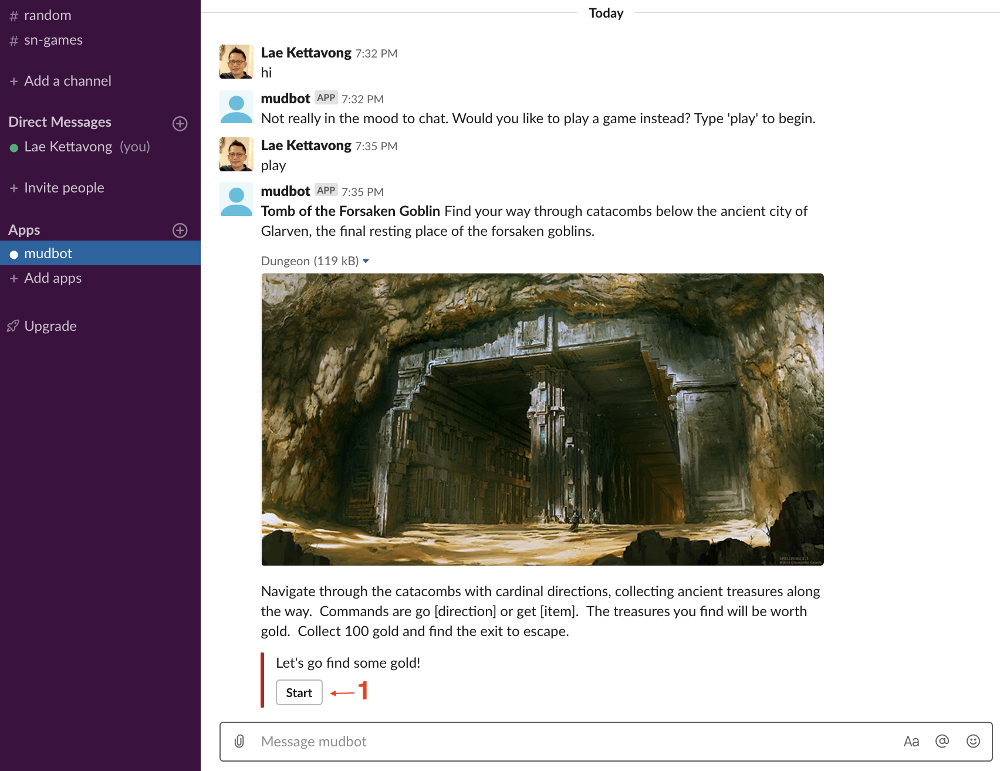
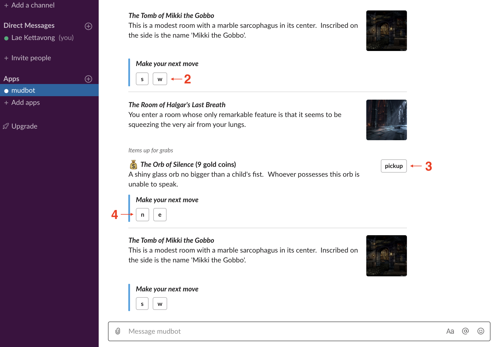

# mud-slack-bot

A node.js - Slack bot integration proof of concept using object-oriented programming via ES6 classes. The concept was built around a Zork-like multi-user-dungeon game whereby Slack [interactive components](https://api.slack.com/reference/block-kit/interactive-components) were utilized to add interactivity for which users can use to navigate various dungeon chambers, pick up "loot", view inventory, etc.. The game is initiated when the Slack user direct messages the `mudbot` to tell it that she wants to play a game. When started, the player is placed at the entrance of the dungeon. Upon entering the dungeon, the player is placed in a random chamber. There on, the player can navigate the chambers and collect bags of gold coins. When one hundred gold coins are collected, the player is allowed to find the dungeon exit and leave the game. First player to do so wins. There is not a lot of complexity within the game, the goal of the exercise was to learn how to leverage Slack interactive components within a node app.

Tech stack: ES6, Node, Koa
Principles/design patterns: SOLID, OOP, Factory, Facade, Observer, Singleton, Decorator

### Initiate play

### Navigate dungeon

### Steps to configure Slack for the app
[configuration doc](docs/slack-api-setup.pdf)

